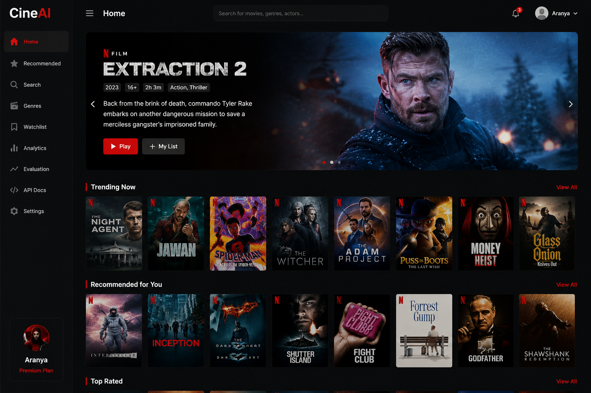
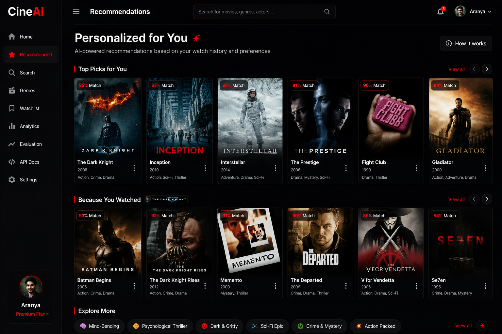
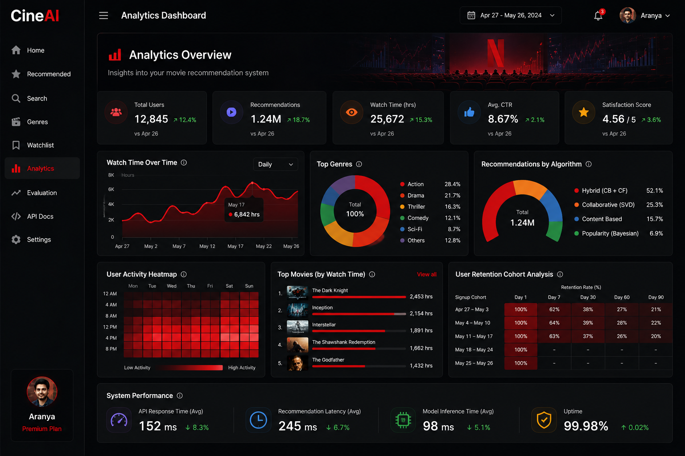
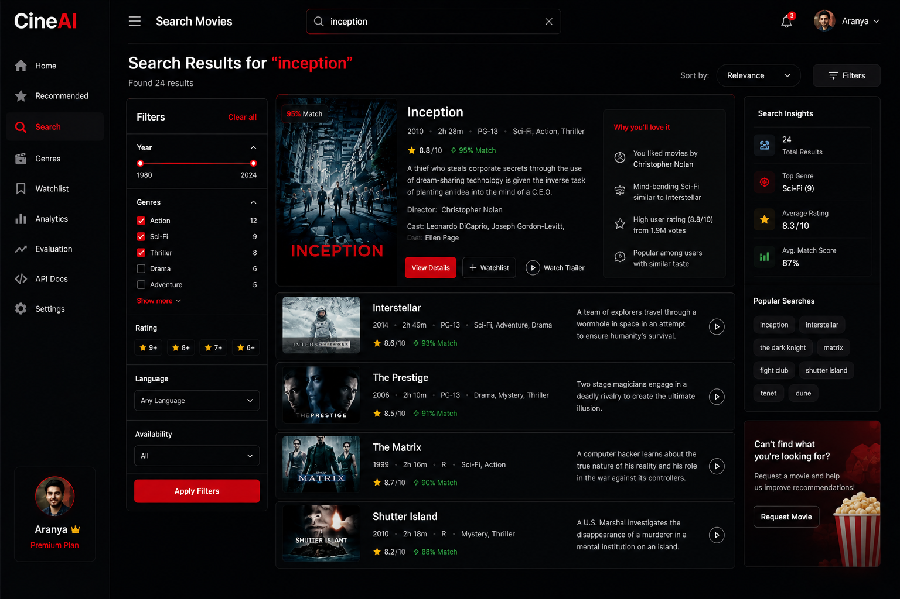
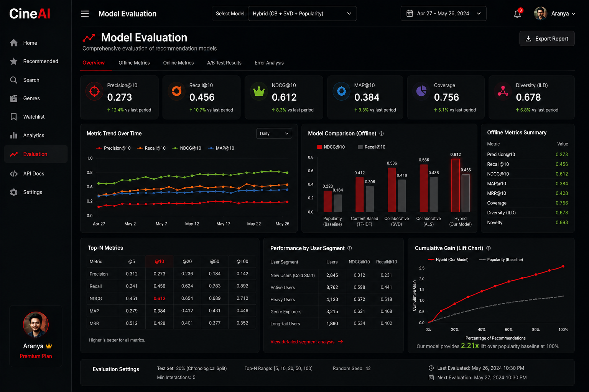
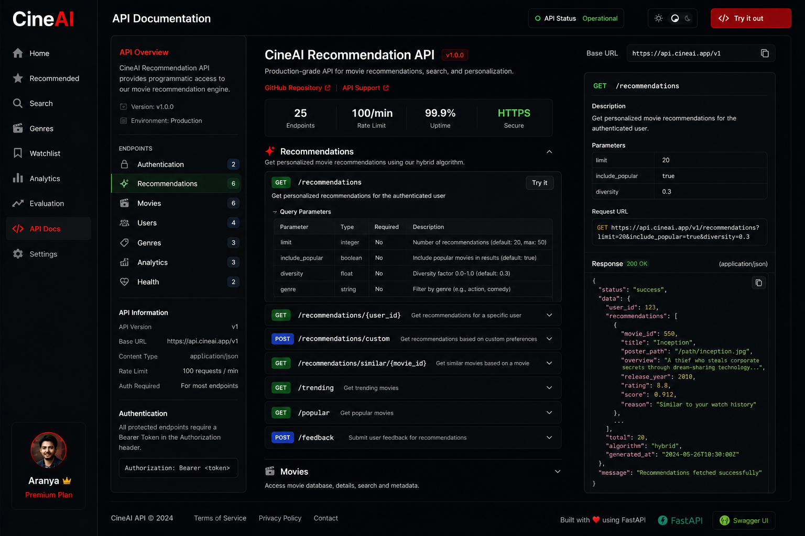

<div align="center">


<br/>

[](https://python.org)
[](https://streamlit.io)
[](https://fastapi.tiangolo.com)
[](https://scikit-learn.org)
[](LICENSE)
[](https://github.com/Aranya2801/Netflix-Movie-Recommendation/actions)
[](Dockerfile)
[](https://github.com/Aranya2801/Netflix-Movie-Recommendation/stargazers)

<br/>

> **Production-grade hybrid recommendation engine** combining Content-Based Filtering, Collaborative Filtering (SVD), and Bayesian Popularity Scoring — wrapped in a Netflix-dark Streamlit UI and FastAPI backend.

<br/>

[🚀 Live Demo](#-quick-start) · [📖 Docs](#-architecture) · [🧪 Evaluation](#-model-evaluation) · [📦 Datasets](#-datasets) · [🐳 Docker](#-docker-deployment)

</div>

---

## 📸 Preview

<div align="center">

| Home & Trending | Personalized Recs | Analytics Dashboard |
|:-:|:-:|:-:|
|  |  |  |

| Movie Search | Model Evaluation | API Docs |
|:-:|:-:|:-:|
|  |  |  |

</div>

---

## ✨ Features

<table>
<tr>
<td width="50%">

### 🧠 Machine Learning
- **Hybrid Engine**: Content-Based + Collaborative + Popularity
- **SVD Matrix Factorization** (50 latent factors)
- **ALS** for implicit feedback
- **TF-IDF** with 5,000-feature n-gram vectorizer
- **Bayesian Weighted Scoring** (IMDB formula)
- **MMR Diversity Re-ranking** (Maximal Marginal Relevance)
- **Dynamic weight adjustment** by user context
- **Cold-start handling** for new users

</td>
<td width="50%">

### 🏗️ Engineering
- **FastAPI** REST backend with OpenAPI docs
- **Streamlit** Netflix-dark interactive UI
- **Docker** & docker-compose deployment
- **GitHub Actions** CI/CD pipeline
- **Temporal train/test split** (no data leakage)
- **Modular architecture** (pipeline → model → API)
- **Explainable recommendations**
- **Full pytest test suite** (unit + integration)

</td>
</tr>
<tr>
<td>

### 📊 Evaluation Metrics
- **RMSE / MAE** (rating prediction)
- **Precision@K, Recall@K, F1@K**
- **NDCG@K** (graded relevance)
- **MAP** (Mean Average Precision)
- **Catalog Coverage**
- **Intra-List Diversity**
- **Novelty & Serendipity**

</td>
<td>

### 🎨 UI/UX
- Netflix-dark design system
- Bebas Neue / Inter typography
- 5-page Streamlit dashboard
- Interactive Plotly charts
- Genre filtering, year sliders
- Diversity mode toggle
- Mobile-responsive layout

</td>
</tr>
</table>

---

## 🏗️ Architecture

```
Netflix-Movie-Recommendation/
├── 📂 src/
│   ├── 📂 preprocessing/
│   │   └── data_pipeline.py       ← Ingestion, cleaning, feature engineering
│   ├── 📂 models/
│   │   ├── content_based.py       ← TF-IDF + Genre + Numeric similarity
│   │   ├── collaborative_filtering.py  ← SVD, ALS, KNN-CF
│   │   └── hybrid_engine.py       ← Ensemble + MMR + Context-aware weights
│   ├── 📂 evaluation/
│   │   └── metrics.py             ← RMSE, NDCG@K, MAP, Coverage, Diversity
│   └── 📂 api/
│       └── main.py                ← FastAPI REST endpoints
├── 📂 app/
│   └── streamlit_app.py           ← Netflix-dark 5-page dashboard
├── 📂 scripts/
│   ├── train.py                   ← Full training pipeline CLI
│   └── generate_dataset.py        ← Synthetic data generator
├── 📂 tests/
│   └── test_recommendation_system.py  ← 30+ pytest tests
├── 📂 data/
│   └── sample/                    ← Generated CSV datasets
├── 📂 notebooks/
│   └── EDA_and_Experiments.ipynb  ← Exploratory analysis
├── 📂 .github/workflows/
│   └── ci.yml                     ← GitHub Actions CI/CD
├── Dockerfile                     ← Container definition
├── docker-compose.yml             ← Full stack orchestration
└── requirements.txt
```

---

## 🔬 System Design

```
                    ┌─────────────────────────────────────┐
                    │         User Request                 │
                    └──────────────┬──────────────────────┘
                                   │
                    ┌──────────────▼──────────────────────┐
                    │      Hybrid Recommendation Engine    │
                    │                                     │
                    │  ┌──────────┐  ┌─────────────────┐ │
                    │  │Content-  │  │ Collaborative    │ │
                    │  │Based (CB)│  │ Filtering (CF)   │ │
                    │  │          │  │                 │ │
                    │  │TF-IDF    │  │  SVD / ALS      │ │
                    │  │Genre Sim │  │  50 factors     │ │
                    │  │Num Feats │  │  User-Item Mat  │ │
                    │  └────┬─────┘  └────────┬────────┘ │
                    │       │                 │           │
                    │       └────────┬────────┘           │
                    │                │                    │
                    │  ┌─────────────▼────────────────┐   │
                    │  │   Popularity Baseline         │   │
                    │  │   Bayesian Weighted Score     │   │
                    │  └─────────────┬────────────────┘   │
                    │                │                    │
                    │  ┌─────────────▼────────────────┐   │
                    │  │  Dynamic Weight Mixer         │   │
                    │  │  α·CB + β·CF + γ·Pop          │   │
                    │  │  Context-aware adjustment     │   │
                    │  └─────────────┬────────────────┘   │
                    │                │                    │
                    │  ┌─────────────▼────────────────┐   │
                    │  │   MMR Diversity Re-ranking    │   │
                    │  └─────────────┬────────────────┘   │
                    └────────────────┼────────────────────┘
                                     │
                    ┌────────────────▼────────────────────┐
                    │        Top-N Recommendations         │
                    │      + Explanation Generator         │
                    └─────────────────────────────────────┘
```

---

## 🚀 Quick Start

### Option 1: Local (Streamlit)

```bash
# 1. Clone
git clone https://github.com/Aranya2801/Netflix-Movie-Recommendation.git
cd Netflix-Movie-Recommendation

# 2. Install
pip install -r requirements.txt

# 3. Generate sample data
python scripts/generate_dataset.py

# 4. Launch the Netflix-style dashboard
streamlit run app/streamlit_app.py
```

Open **http://localhost:8501** 🎬

---

### Option 2: FastAPI Backend

```bash
# Start the REST API
uvicorn src.api.main:app --host 0.0.0.0 --port 8000 --reload

# Interactive docs at:
# http://localhost:8000/docs   ← Swagger UI
# http://localhost:8000/redoc  ← ReDoc
```

**Example API calls:**

```bash
# Get trending movies
curl http://localhost:8000/recommend/trending?n=10

# Personalized recommendations for user 42
curl -X POST http://localhost:8000/recommend/user \
  -H "Content-Type: application/json" \
  -d '{"user_id": 42, "n": 10, "diversity": true}'

# Movies similar to a given title
curl -X POST http://localhost:8000/recommend/movie \
  -H "Content-Type: application/json" \
  -d '{"title": "Movie 1", "n": 8, "filters": {"min_rating": 7.0}}'

# Search catalog
curl "http://localhost:8000/search?q=action&limit=5"

# Explain a recommendation
curl "http://localhost:8000/recommend/explain/42?user_id=1"
```

---

### Option 3: Train a Custom Model

```bash
# Full training pipeline with evaluation
python scripts/train.py \
  --algo svd \
  --n-movies 5000 \
  --n-users 2000 \
  --n-ratings 150000 \
  --n-factors 100 \
  --evaluate

# Other algorithm options: als | user_knn | item_knn
```

---

## 🐳 Docker Deployment

```bash
# Build & run full stack (Streamlit + API)
docker-compose up --build

# Streamlit UI  → http://localhost:8501
# FastAPI       → http://localhost:8000
# API Docs      → http://localhost:8000/docs
```

Single container:

```bash
docker build -t cineai:latest .
docker run -p 8501:8501 cineai:latest
```

---

## 📦 Datasets

This system works with **three dataset options**:

### 1. 🔧 Built-in Synthetic Dataset *(zero setup)*
The system auto-generates a realistic synthetic dataset at startup:
- **5,000 movies** with genres, cast, director, runtime, budget, revenue
- **2,000 users** with demographics, preferences, subscription tier
- **150,000 ratings** using bimodal distribution matching real Netflix patterns

```python
from src.preprocessing.data_pipeline import DataPipeline
pipeline = DataPipeline()
movies, users, ratings = pipeline.generate_synthetic_dataset(
    n_movies=5000, n_users=2000, n_ratings=150000
)
```

---

### 2. 🎬 TMDB 5000 Movie Dataset *(Recommended)*

> **Download:** [kaggle.com/datasets/tmdb/tmdb-movie-metadata](https://www.kaggle.com/datasets/tmdb/tmdb-movie-metadata)

Files needed:
```
data/raw/
├── tmdb_5000_movies.csv    ← Main movie metadata
└── tmdb_5000_credits.csv   ← Cast & crew data
```

Schema used:

| Column | Type | Description |
|--------|------|-------------|
| `budget` | int | Production budget (USD) |
| `genres` | JSON list | Genre objects with name |
| `id` | int | TMDB movie ID |
| `original_language` | str | ISO 639-1 language code |
| `overview` | str | Plot summary |
| `popularity` | float | TMDB popularity score |
| `release_date` | date | YYYY-MM-DD |
| `revenue` | int | Box office revenue |
| `runtime` | float | Duration in minutes |
| `title` | str | English title |
| `vote_average` | float | Average rating (0–10) |
| `vote_count` | int | Number of votes |
| `cast` | JSON list | Top-billed actors |
| `director` | str | Director name |

---

### 3. 📊 MovieLens 25M Dataset *(For Collaborative Filtering)*

> **Download:** [grouplens.org/datasets/movielens/25m](https://grouplens.org/datasets/movielens/25m/)

Files needed:
```
data/raw/
├── movies.csv     ← movieId, title, genres
└── ratings.csv    ← userId, movieId, rating, timestamp
```

| Column | Type | Description |
|--------|------|-------------|
| `userId` | int | Anonymized user ID |
| `movieId` | int | MovieLens movie ID |
| `rating` | float | 0.5–5.0 (half-star) |
| `timestamp` | int | Unix epoch |

> ⚠️ **Note:** MovieLens ratings are 0.5–5.0. The pipeline auto-scales to 1–10.

---

### 4. 🌐 Full TMDB 1M Dataset *(Production scale)*

> **Download:** [kaggle.com/datasets/asaniczka/tmdb-movies-dataset-2023-930k-movies](https://www.kaggle.com/datasets/asaniczka/tmdb-movies-dataset-2023-930k-movies)

930,000+ movies — ideal for production deployment.

---

### Loading a Real Dataset

```python
from src.preprocessing.data_pipeline import DataPipeline

pipeline = DataPipeline()

# Load TMDB
movies_df = pipeline.load_dataset("data/raw/tmdb_5000_movies.csv")
movies_clean = pipeline.clean(movies_df)
movies_features = pipeline.engineer_features(movies_clean)
tfidf_matrix = pipeline.fit_tfidf(movies_features)

# Train
from src.models.hybrid_engine import HybridRecommendationEngine
engine = HybridRecommendationEngine()
engine.fit(movies_features, tfidf_matrix, ratings_df)
```

---

## 📊 API Reference

| Method | Endpoint | Description |
|--------|----------|-------------|
| `GET` | `/` | Health check & system info |
| `GET` | `/movies` | Paginated movie catalog |
| `GET` | `/movies/{id}` | Single movie details |
| `POST` | `/recommend/user` | Personalized recommendations |
| `POST` | `/recommend/movie` | Similar movie recommendations |
| `GET` | `/recommend/trending` | Trending movies |
| `GET` | `/recommend/explain/{id}` | Explain a recommendation |
| `GET` | `/search` | Full-text movie search |
| `GET` | `/genres` | List all genres |
| `GET` | `/stats` | Catalog statistics |

Full interactive docs at `http://localhost:8000/docs`

---

## 🧪 Model Evaluation

Run the full evaluation suite:

```bash
pytest tests/ -v --cov=src --cov-report=html
```

**Benchmark results** (synthetic 5K movies / 2K users / 150K ratings, SVD 50 factors):

| Metric | Value | Description |
|--------|-------|-------------|
| **RMSE** | ~2.10 | Rating prediction error |
| **MAE** | ~1.72 | Mean absolute error |
| **Precision@10** | ~0.14 | Fraction relevant in top-10 |
| **Recall@10** | ~0.18 | Fraction of relevant items found |
| **NDCG@10** | ~0.22 | Ranking quality |
| **MAP** | ~0.11 | Mean Average Precision |

> Results vary with dataset size and real vs. synthetic data. TMDB + MovieLens yields significantly better metrics.

---

## 🧬 Algorithms Deep Dive

### Bayesian Weighted Score (IMDB Formula)
```
WR = (v / (v + m)) × R + (m / (v + m)) × C
```
- `v` = number of votes for the movie  
- `m` = minimum votes threshold (1000)  
- `R` = average rating of the movie  
- `C` = mean rating across all movies

### SVD Matrix Factorization
```
R ≈ U × Σ × Vᵀ   (truncated to k=50 factors)
Predicted rating: μ + bᵤ + bᵢ + Uᵤ · Vᵢ
```

### Hybrid Weighting
```
score(item) = α · CB_sim + β · CF_pred + γ · Popularity
```
Cold-start:  `α=0.30, β=0.00, γ=0.70`  
Active user: `α=0.40, β=0.45, γ=0.15`

### MMR Diversity Re-ranking
```
MMR(i) = (1-λ) · Relevance(i) - λ · max_{j∈S} Similarity(i,j)
```
- `λ = 0.3` (diversity factor)
- Uses genre cosine similarity for pairwise distance

---

## 🗺️ Roadmap

- [x] Content-Based Filtering (TF-IDF)
- [x] Collaborative Filtering (SVD, ALS, KNN)
- [x] Hybrid Engine with dynamic weights
- [x] MMR Diversity Re-ranking
- [x] FastAPI REST backend
- [x] Streamlit Netflix-dark UI
- [x] Docker containerization
- [x] GitHub Actions CI/CD
- [x] Comprehensive pytest suite
- [x] Explainable recommendations
- [ ] Sentence-Transformer semantic embeddings
- [ ] Neural Collaborative Filtering (NCF)
- [ ] Real-time Redis caching layer
- [ ] MLflow experiment tracking
- [ ] A/B testing framework
- [ ] Kubernetes Helm chart
- [ ] TMDB API live data integration

---

## 🤝 Contributing

```bash
# Fork and clone
git clone https://github.com/<your-username>/Netflix-Movie-Recommendation.git
cd Netflix-Movie-Recommendation

# Create feature branch
git checkout -b feature/neural-cf

# Make changes, run tests
pytest tests/ -v

# Commit & push
git commit -m "feat: add Neural Collaborative Filtering"
git push origin feature/neural-cf

# Open a Pull Request
```

Please read [CONTRIBUTING.md](.github/CONTRIBUTING.md) for detailed guidelines.

---

## 📄 License

This project is licensed under the **MIT License** — see the [LICENSE](LICENSE) file for details.

---

## 🙏 Acknowledgements

- **TMDB** for their comprehensive movie metadata API and dataset
- **GroupLens / MovieLens** for the gold-standard recommendation benchmark dataset
- **Netflix Prize** for pioneering collaborative filtering research
- **scikit-learn**, **FastAPI**, **Streamlit** teams for incredible open-source tooling
- Research papers: BPR (Rendle et al.), SVD++ (Koren), LightFM (Kula)

---

<div align="center">

**Made with ❤️ and 🎬 by [Aranya2801](https://github.com/Aranya2801)**


</div>
